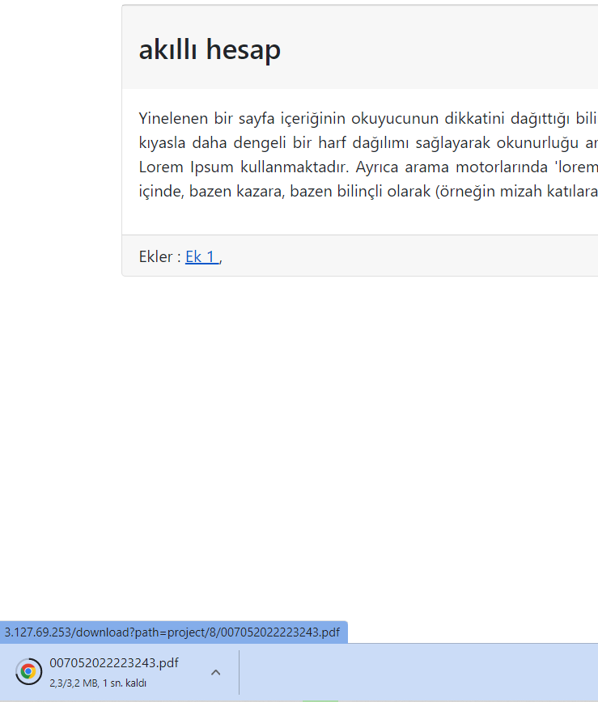

**KOCAELİ ÜNİVERSİTESİ**

**PROJE DESTEK SİSTEMİ**

*Turan ÖZ – 181307006*

*Kemal BALI – 181307049*

[*181307006@kocaeli.edu.tr*](mailto:181307072@kocaeli.edu.tr)

[*181307049@kocaeli.edu.tr*](mailto:181307059@kocaeli.edu.tr)

# GİRİŞ

İki kişi olacak şekilde belirlenen gruplar sonrası grubumuzu belirleyerek işe başladık. Projemizi belirlerken çoğu proje grubunun proje konusu bulmakta zorlandığını gördük. Bunun için proje öneri sistemini geliştirmeye karar verdik. Grup üyeleri daha önce bulut teknolojileri çok az kullandığımız için öncelikle araştırmalar yaptık. Bulut sistemi nedir? Ne için kullanılır? Gibi sorulara cevap aradık. Projemize başlamadan önce hep birlikte proje isterlerini birkaç kez okuyup anlayarak notlar çıkardık. Beraber araştırma yaparak projemizi hangi yazılım uygulaması ile yaparsak daha başarılı oluruz diye tartıştık. İsterler de uygun olan ve bizim için de anlaşılması ve uygulaması kolay olacak yazılım dilleri üzerinde durduk. Görev paylaşımını yaptıktan sonra ödevimizi yapmaya başladık. Projemiz için uygun olan yazılım dillerini toplantılar ile belirledik.

Cloud sistemi olarak Bize en uygun olduğuna karar verdiğimiz amazon cloud sistemini kullandık.

Projemiz insanların proje bulmakta zorlanmasının önüne geçmektir. Bu sistem sayesinde insanlar önerilen projeler vesilesiyle akıllarında hem farklı fikirler oluşabilir hem de hali hali hazırda bulunan proje önerilerini gerçekleştirmeye imkan sağlayabilir.

# SÖZDE KOD

-   Sözde kodumuzda kullanıcı sisteme kayıt olunarak başlanıyor.
-   Kayıt olunduktan sonra sisteme giriş yapılıyor.
-   Sistemde önerilen projeler görüntüleniyor.
-   Sisteme proje önerisi sunuluyor.
-   Sunulan proje veritabanına kaydediliyor.
-   Kullanıcılar sistemde öneriler proje konusu için görüntülenme sağlanıyor.
1.  Başla
2.  Üye Ol
3.  Giriş Yap
4.  Projelerine Gir
5.  Proje Önerisi Sun
6.  Bitir

# PROJE DESTEK SİSTEMİ TASARIMI

Resim 3.1 – Sisteme Giriş

Proje destek sistemine daha önce üyeliğiniz varsa giriş yap ile yoksa üye olup giriş yaparak devam edebilirsiniz.

Resim 3.2 – Üye ol

Üye olmak için ad soyad, eposta adresi ve son olarak şifre oluşturarak sisteme kayıt olabilirsiniz

Resim 3.3 – Projeler ekranı

Burada kullanıcı daha önce sisteme yüklenen bütün projeleri görüntüleyebilir.

Resim 3.4 – Araç Çubuğu

Benim projelerim kontrol edilebilir veya çıkış yapılabilir.

Resim 3.5 – Benim Projelerim

Benim projelerim kısmında şuanda hiçbir proje yok proje eklemek için proje ekle butonuna tıklayacağız.

Resim 3.6 – Proje Ekle

Proje ve detayları giriliyor ve daha sonra kaydediliyor.

Resim 3.7 – Eklenen proje görüntülenmesi

Burada eklediğimiz projeyi projelerim ekranına düştüğünü görmekteyiz.

Resim 3.8 - Ek

Proje ile ilgili ekler burada indiriliyor.

# VERİTABANI TASARIMI

Projemizde belirlediğimiz verilere göre veri tabanı tasarım aşamasına geçtik. Veritabanı da kullanacağımız varlıkları ve daha sonra nitelikleri belirledik. Bunlar arasında ilişkileri oluşturduktan sonra varlık ilişki diyagramımızı kağıt üzerinde denemeler yaptık . son olarak hazır halini mysql ile veritabanı kısmını yaptık. Veri tabanımızı amazon cloud sistemine entegre ederek bu süreci tamamladık.

## 

# LİTERATÜR TARAMASI

Yaptığımız uygulamada literatür araştırması yaptığımız zaman devletin vatandaşlar için sunmuş olduğu web siteleri bizim yaptığımız projeye benzer olduğunu belirledik. Benzerlikler olarak tasarımlar, projenin yapılma amacı, başvuru ekranları benzer gördüğümüz özelliklerdendi.

**Tarım orman şûrası:**

Tarım ve orman bakanlığının yapmış olduğu uygulamada kullanıcılardan fikir alınması amaçlanmıştır. Alınan bu fikirler tarım ve orman bakanlığı ile inceleniyor.

Resim 5.1 – Anasayfa

Bu ekranda çoğunlukla tanıtımlara yer verildi.

Yürütme kurulu, iletişim, sponsorlar vs. ekranlara ulaşa biliniyor.

Resim 5.2 – İletişim ekranı

Bu ekranda iletişim için bir harita eklenmiş.

Resim 5.3 - Fikir sunma

Bu ekranda kullanıcı fikirlerini sunması için bir buton ile yönlendirme verilmiş.

Resim 5.4 – Proje ekleme

Bu ekranda kullanıcı aklındaki projeyi detaylı bir şekilde açıklayacak ve pdf ekini de sisteme koymalıdır.

# KULLANDIĞIMIZ TEKNOLOJİLER

## HTML

Temel gereği yazı, görüntü, video gibi değişik verileri ve bunları içeren sayfaları birbirine basitçe bağlamak, buna ek olarak söz konusu sayfaların web tarayıcısı yazılımları tarafından düzgün olarak görüntülenmesi için gerekli kuralları belirlemektir. HTML kodunu web tarayıcıları okur, yorumlar ve görsel hale dönüştürürler, dolayısıyla aynı HTML kodunun farklı tarayıcılarda farklı sonuç vermesi olasıdır. CSS ve JavaScript ile beraber kullanıldığında HTML vasıtasıyla görsel ve dinamik web siteleri yaratılabilir.

## CSS

İnternet sayfaları için genelgeçer şablonlar hazırlama olanağı verdiği gibi, bağımsız olarak harflerin stilini, yani renk, yazı tipi, büyüklük gibi özelliklerini değiştirmek için de kullanılabilir. Bu tekniğin en önemli özelliği kullanımındaki esnekliktir.

Bir Web sayfası içerisinde birbiriyle uyumlu birkaç renk ve birkaç yazı tip kullanılır ve bunları her sayfada ayrı ayrı tekrar belirtmek yerine CSS yardımıyla bir sefer tanımlayıp bütün Web sayfalarında ortak olarak kullanılabilir. Böylece sayfaların hafızadaki boyutu epey küçüldüğü gibi güncelleme yapmak da kolaylaşır.

## JavaScript

## 

JavaScript’in Html sayfalarının içeriklerini veya stillerini dinamik olarak eklemenize ve değiştirmenize izin vermesidir. JavaScript çalışma anında web sayfasını veya CSS öğelerini oluşturup değiştirebilen ve web sayfalarının görünümünü güncelleyebilen çeşitli yöntemler sunar.

JavaScript, açılır menü gibi gezinme araçları ile web sitelerinin tasarımını geliştirebilir. JavaScript yardımıyla web sayfalarında fare ve klavye eylemlerini özelleştirebilirsiniz.

## PHP

PHP'yi Javascript gibi kullanıcı tarafında çalışan dillerden ayıran, sunucu tarafında çalıştırılıyor olmasıdır. Yukardaki örnekteki kodu kendi sunucunuzda çalıştırırsanız, sitenize bağlanan kullanıcılar kodu göremeyecekler ve müdahale edemeyecekler, yalnızca sonucu görebileceklerdir. Dilerseniz HTTP sunucunuzu bütün HTML dosyalarınızı PHP dosyası olarak görüp işleyecek hale bile getirebilirsiniz. Buna rağmen kullanıcılar sizin gerçekte sunucu taraflı bir uygulama kullandığınızı fark edemeyebilirler.

## Laravel

Laravel, web uygulamalarını daha hızlı ve kolay bir şekilde geliştirmeyi sağlayan, açık kaynak kodlu bir PHP framework’tür. Geliştiricilere sunduğu çeşitli özellikler sayesinde web geliştiricilerinin büyük bir çoğunluğu tarafından tercih edilmektedir.

Sunucu tarafında çalışan Laravel ile backend özellikler gerektiren uygulamalar geliştirmek mümkün olmaktadır. Modüler paket sistemi, yetkilendirme sistemi, obje ilişkili haritalaması, komut satırı arayüzü, otomatik test özellikleri ve sanal geliştirme ortamı gibi çeşitli özellikleri ile geliştiricilere büyük kolaylıklar sunmaktadır.

Farklı framework’lerin mevcut parçalarını kullanarak web uygulaması geliştirmeyi kolaylaştırmaktadır. Bu sayede web uygulamaları daha düzgün yapıya sahip olurken aynı zamanda daha işlevsel hale gelmektedir.

## Amazon Web Services (AWS) bulut bilişim ve depolama hizmetleri sunar. AWS, işletmelerin ölçeklenmesine ve büyümesine yardımcı olmak için bilgi işlem gücü, veritabanı depolama, içerik teslimi ve daha farklı işlevler sunan güvenli ve esnek bir bulut hizmetleri platformudur.

Amazon da kullandığımız hizmetler:

-   **EC2**

    Amazon Elastic Compute Cloud (*Amazon EC2*), bulutta güvenli, yeniden boyutlandırılabilen işlem kapasitesi sağlayan bir sanal sunucu hizmetidir. Çok basit bir şekilde ifade etmek gerekirse, bir işletim sistemi ve seçtiğiniz donanım bileşenlerine sahip bir makinedir ancak farkı tamamen sanallaştırılmış olmasıdır.

-   **S3**

Amazon S3 her yerden, her boyutta veri almak ve depolamak için oluşturulmuş bir nesne depolama hizmetidir. Çok düşük maliyetlerde sektör lideri dayanıklılık, erişilebilirlik, performans, güvenlik ve neredeyse sınırsız ölçeklenebilirlik sunan basit bir depolama hizmetidir.

Bizde s3 ile sisteme pdf veya word gibi dosyalar yüklenerek depolanmasını sağlıyor.

-   **RDS**

Amazon RDS, tanıdık bir MySQL, MariaDB, Oracle, SQL Server veya PostgreSQL veritabanının özelliklerine erişmenize imkan tanır. Bu, mevcut veritabanlarınız ile kullandığınız kodun, uygulamaların ve araçların Amazon RDS ile sorunsuz bir şekilde çalışması gerektiği anlamına gelir. Amazon RDS, veritabanınızı otomatik olarak yedekleyebilir ve veritabanı yazılımlarınızın en son sürümle güncel kalmasını sağlayabilir. İlişkisel veritabanı bulut sunucunuzla ilişkili işlem kaynaklarını veya depolama kapasitesini kolayca ölçeklendirebilme avantajından yararlanırsınız. Ayrıca, Amazon RDS replikasyon yoluyla veritabanı erişilebilirliğini geliştirmeyi, veri dayanıklılığını artırmayı veya yoğun okuma gerektiren veritabanı iş yükleri için tek bir veritabanı bulut sunucusunun kapasite kısıtlamalarını aşacak şekilde ölçeklendirmeyi kolaylaştırır.

-   **IAM**

[IAM rolleriyle](https://docs.aws.amazon.com/IAM/latest/UserGuide/id_roles.html), AWS hesabınızda çalışması için kullanıcılara veya AWS hizmetlerine erişim yetkisi verebilirsiniz. Kimlik sağlayıcınızdaki kullanıcılar veya AWS hizmetleri, IAM rolü hesabında AWS isteğinde bulunmak için kullanılabilecek güvenlikle ilgili geçici kimlik bilgilerini alma rolünü üstlenebilir. Sonuç olarak IAM rolleri, AWS hesaplarınızda işlem yapması gereken kullanıcılar, iş yükleri ve AWS hizmetleri için kısa süreli kimlik bilgilerinden yararlanmanın bir yolunu sağlar.

## Mysql

Mysql'de veritabanı tasarımı yaparken ilişkilerin doğru şekilde belirlenmesi için bir tasarım aracına ihtiyaç duyuluyor, bu yüzden workbench kullanıyoruz. Workbench, sql sorgusu yazmadan ER (Varlık-İlişki) diyagramına göre veritabanınızı şekillendiriyor. Tablo ve ilişkileri oluşturuyor.

# VERİTABANI DİYAGRAMI

# PROJENİN HAZIRLANMASINDA KARŞILAŞTIĞIMIZ ZORLUKLAR VE BULDUĞUMUZ ÇÖZÜMLER

İlk sorununuzu projenin belirlenmesi konusunda yaşadık. Düşündüğümüz bazı projelerin bulut sistemine uygun olmadığını düşündüğümüz için bu konu üzerinde çok durduk. Bu sorunu sınıfta yaşadığımız proje belirleme sorununu fark ederek çözdük.

Cloud sistemini minimum masrafla ve projeye en etkili olabilecek şekilde olması için amazon cloud sistemini seçtik. Bu aşamadaki zorluk yaşadığımız nokta ise sistemin kullanabilirliğini öğrenmek ve hangi teknolojileri kullanabileceğimiz nokta oldu.

Projemize birçok ödevimiz olduğunu için geç başlamıştık ve tarihin planlanan tarihten öne çekme durumu olduğu için bir süre karışıklık yaşadık ama beklediğimiz gibi olmadı.

# PROJENİN BİZE KATMIŞ OLDUĞU BİLGİLER

Grup çalışmasını ne kadar önemli olduğunu öğretti. Zamanı verimli bir şekilde yönetmeyi ve bu zaman içerisine bir çok farklı zorlukların üstesinden gelmeyi başardık.

İlk defa bulut sistemi ile çalışma fırsatımız oldu. Bulut sistemlerinin projelerde kullanarak birçok işimizin arka planda daha kullanılabilir olduğunu gördük.

Bu kısa sürede daha önce kullanmadığımız programları öğrenip üstüne proje geliştirmek bizim için artı bir değer oldu.

# KAYNAKÇA

[1] <https://laravel.com/docs/9.x/installation>

[2] [https://mahmutbayri.com/laravel-istekle](https://mahmutbayri.com/laravel-istekle%09)

[3] <https://laravel.gen.tr/>

[4] <https://laravel.gen.tr/d/6366-iliskilendirme-sorunum>

[5] <https://laravel.com/docs/9.x/views>

[6] <https://learn2torials.com/a/laravel-view-composers>

[7] <https://vegibit.com/what-is-a-view-composer-in-laravel/>

[8] <https://medium.com/@bvipul/view-composers-in-laravel-1898e4412890>

[9] <https://appdividend.com/2022/01/13/sql-ascii-function/>

[10] <https://blog.quickadminpanel.com/laravel-belongstomany-add-extra-fields-to-pivot-table/>

[11] <https://stackoverflow.com/questions/69342846/error-when-try-to-store-token-firebase-laravel-notification-referenceerror-can>

[12] <https://www.youtube.com/watch?v=ayKMfVt2Sg4>

[13] <https://www.youtube.com/watch?v=juKDXPk7kU4>

[14] <https://laravel.gen.tr/u/turanoz>

[15]https://vegibit.com/laravel-belongstomany-example/

[16] <https://stackoverflow.com/questions/69457102/laravel-8-define-belongstomany-definition-in-model-factory>

[17] <https://tr.wikipedia.org/wiki/CSS>

[18] <https://www.php.net/manual/tr/intro-whatis.php>

[19] <https://laravel.com/docs/8.x/blade>

[20] [https://www.tutorialspoint.com/php/php_syn tax_overview.htm](https://www.tutorialspoint.com/php/php_syntax_overview.htm)

[21] <https://www.free-css.com/free-css-templates>

[22] <https://www.youtube.com/watch?v=h6cAow6CrdU>

[23] <http://www.tarimormansurasi.gov.tr/>

[24] <https://aws.amazon.com/tr/s3/faqs/>

[25] <https://aws.amazon.com/tr/iam/features/>

[26] <https://aws.amazon.com/tr/rds/faqs/>

[27] <https://aws.amazon.com/tr/ec2/>

[28] <https://awsegitimi.com/tr/blog/1354/amazon-ec2-nedir-ec2-neden-bu-kadar-onemlidir-ec2-/>

[29] <https://www.youtube.com/watch?v=p0hYdODTuO8>

# PROJE DOSYALARI

[1] [https://drive.google.com/file/d/1QMR9AdyRBLof4 YR -1lQ2-pds74dJmKvK/view?usp=sharing](https://drive.google.com/file/d/1QMR9AdyRBLof4YR-1lQ2-pds74dJmKvK/view?usp=sharing)

[2] <https://github.com/turanoz/project-support-system-laravel-aws>
